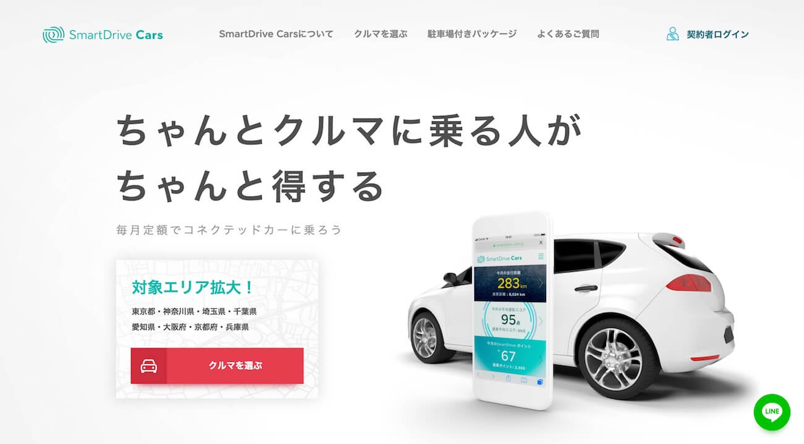
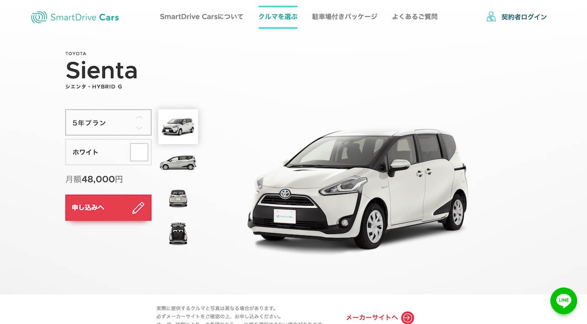
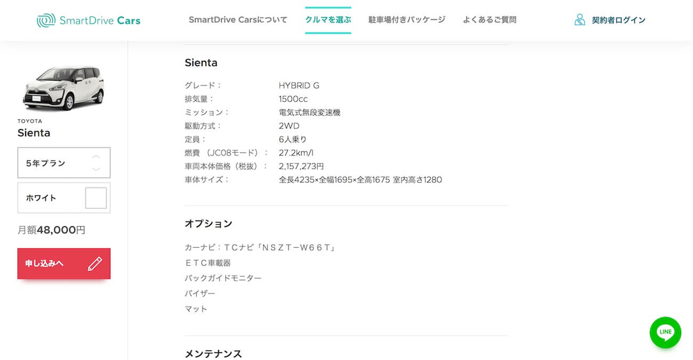

「SmartDrive Cars」のフロントエンド開発を担当しました。
Nuxt.jsによるアプリケーションの開発、機能設計、UI実装などを担当していました。
一部API通信にGraphQLを使用していました。

#### 使用技術
Nuxt.js、GraphQL、Apollo Client、Sass(Scss)、Jest、PWA

[View Project](https://smartdrive-cars.jp)
